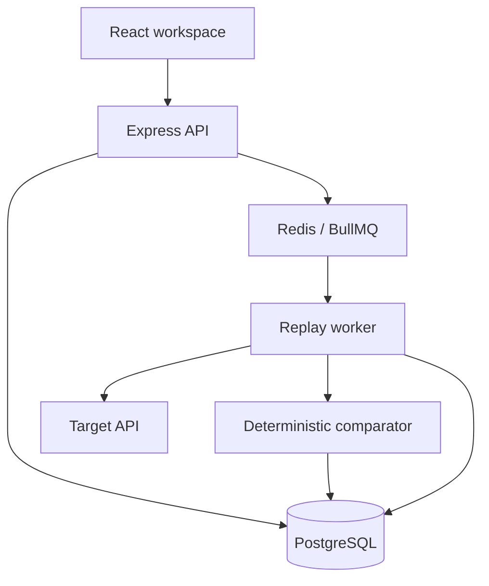
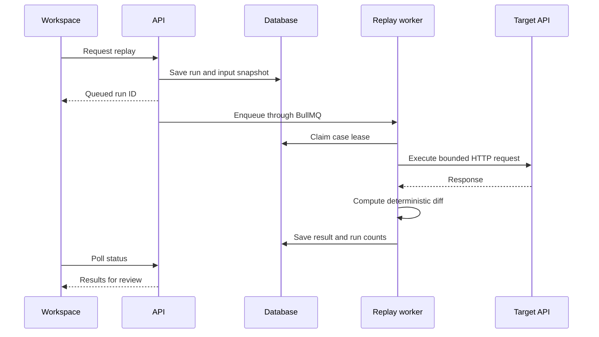

# ReplayLab

[](https://github.com/vipulmodi0304/replayLab/actions/workflows/ci.yml)

**Catch API regressions before your users do.**

**Live app:** https://web-production-4712.up.railway.app/

ReplayLab records approved HTTP responses and replays saved requests against another API version. It compares status codes, response structure, field values, headers, and latency using deterministic rules. Think Git diff for API behavior.

A backend change can compile, pass unit tests, and still break a consumer that expects a numeric ID or an email field. ReplayLab makes those changes reviewable before a deployment.

## Try the demo

Open the [live app](https://web-production-4712.up.railway.app/) and choose **Try the demo**. Each authenticated account receives an isolated **Demo Commerce API** project with three requests:

| Request       | Candidate behavior                                                | Expected result |
| ------------- | ----------------------------------------------------------------- | --------------- |
| Get User      | Numeric `id` and `profile.age` become strings; `email` disappears | Breaking        |
| Get Order     | Response time fixture changes from 120 ms to 460 ms               | Warning         |
| List Products | Response matches the baseline                                     | Passed          |

Choose **Run replay**, wait for the comparison, and open **Get User → JSON diff**. Built-in response times are explicitly labeled fixtures, not measurements of a production service. New replay run durations measure actual local processing time.

## What is implemented

- Private projects, environments, and saved request CRUD, including duplication and deletion confirmations.
- Request sending, server-recorded snapshots, and explicit baseline approval/replacement.
- Deterministic nested JSON comparison, readable paths, header rules, numeric tolerance, wildcard ignores, and ordered/unordered primitive arrays.
- Absolute and relative latency thresholds with separate warning/failure severity.
- Immutable run inputs, stored response differences, paginated history, and request search.
- Detailed overview, side-by-side JSON, headers, raw response, and optional AI explanation views.
- An Express API, PostgreSQL/Prisma repository, and a separate Redis/BullMQ worker.
- AES-GCM protected authorization headers, ownership enforcement, bounded responses, and Node DNS-pinned SSRF protections.
- Vitest unit/integration tests, an opt-in PostgreSQL/Redis integration test, a Playwright smoke test, Docker Compose, and CI.

## Deploy on Railway

The root Dockerfile builds the React frontend and Node services. One web service serves the app and API from the same domain; a separate worker processes replay jobs. PostgreSQL stores projects and results, and Redis holds the queue.

See [Railway deployment](docs/railway.md) for repository connection, service settings, variables, and checks. Accounts use ReplayLab email/password login. No external identity provider is required.

## Local setup

Requirements: Node.js 22.19 or newer, pnpm 11.25, Docker with Compose.

From the repository root:

```sh
npm install -g pnpm@11.25.0
pnpm install --frozen-lockfile
node scripts/setup-env.mjs
docker compose up -d postgres redis
pnpm db:client
pnpm db:migrate
pnpm db:seed
pnpm dev
```

Open `http://localhost:5173`. The API runs on port 4000. The frontend proxies `/api` to the API so cookies and requests remain same-origin.

**Demo login:** `demo@replaylab.dev`. Read the generated `DEMO_PASSWORD` in your local `.env`; no shared password is committed. The setup script generates a random demo password and a 32-byte encryption key, and preserves an existing `.env`.

Alternatively start the containerized stack:

```sh
node scripts/setup-env.mjs
docker compose up --build -d
docker compose exec api node node_modules/tsx/dist/cli.mjs prisma/seed.ts
```

Open `http://localhost:8080`. Compose waits for PostgreSQL/Redis health and runs migrations before starting the API and worker. This Compose configuration is for local use; its database password is not a production credential.

## Architecture



The `packages/core` layer contains DTOs, validation, comparison, repository operations, replay processing, and the transport-independent API dispatcher. Infrastructure adapters supply storage, identity, outbound transport, and scheduling. Framework dependencies stay outside the diff engine.



## Configuration

| Variable                         | Purpose                                                                          |
| -------------------------------- | -------------------------------------------------------------------------------- |
| `DATABASE_URL`                   | PostgreSQL connection string for the API and worker                              |
| `REDIS_URL`                      | Redis connection string for BullMQ                                               |
| `ENCRYPTION_KEY`                 | Base64-encoded 32-byte AES-GCM key; retain it across redeployments               |
| `WEB_URL`                        | Exact frontend origin accepted for writes                                        |
| `PORT`, `API_PORT`               | Listen port; `PORT` takes precedence, otherwise 4000                             |
| `SERVE_WEB`                      | Serve the compiled frontend; defaults to true in production                      |
| `TRUST_PROXY_HOPS`               | Trusted proxy hops, default 0; use 1 behind Railway public ingress               |
| `NODE_ENV`                       | `development`, `test`, or `production`; production uses secure cookies           |
| `ALLOW_PRIVATE_NETWORK_TARGETS`  | Development-only escape hatch for a local test target; production rejects `true` |
| `DEMO_PASSWORD`                  | Password used only by the local seed script                                      |
| `AI_ENABLED`                     | Defaults to `false`                                                              |
| `OPENAI_API_KEY`, `OPENAI_MODEL` | Server-only optional explanation provider configuration                          |

There is no JWT signing secret: sessions are random opaque tokens whose hashes are stored in the database. Hosting keys belong in runtime secrets, never in frontend bundles or Git.

## Tests and builds

```sh
pnpm lint
pnpm typecheck
pnpm test
pnpm build
```

Tests normally use an isolated in-memory SQLite database with a checked-in schema fixture, plus Supertest against the real Express application. The PostgreSQL/BullMQ test runs when `DATABASE_URL` and `REDIS_URL` are present in the process environment. CI provisions both services and applies Prisma migrations first. No public APIs are needed.

For a local browser smoke test, start and seed the local stack, then:

```sh
pnpm exec playwright install chromium
node --env-file=.env node_modules/@playwright/test/cli.js test
```

See [verification](docs/verification.md) for the checks that have actually run and the remaining production smoke test. The GitHub Actions workflow has completed successfully on the deployed commit.

## API documentation

Open `/docs` in the app, or fetch `/api/v1/openapi` for the OpenAPI 3.0 specification. All private resources enforce ownership on the server. Errors use `{ error: { code, message, requestId } }` and `X-Request-ID`.

See [API examples](docs/api.md), [architecture](docs/architecture.md), and [diff engine](docs/diff-engine.md).

## Engineering decisions

- **Modular monolith plus worker:** one clear domain model and a separate process only where background work needs it.
- **Deterministic comparison:** the same snapshots and rules produce the same classifications. AI explains results only.
- **PostgreSQL + JSONB:** relations and foreign keys model ownership; JSONB holds response and comparison data. Prisma manages migrations and connections. The repository binds SQL parameters and converts stored rows to explicit DTOs.
- **BullMQ:** jobs are durable and concurrency is bounded. Unsafe requests are never automatically retried.
- **Immutable run input:** saved cases, approved baselines, target configuration, and rules are snapshotted at run creation.
- **At-most-once attempts:** a leased in-flight case with an expired lease fails closed. Avoiding duplicate POST effects is more important than transparently retrying after a crash.
- **Same-origin sessions:** HttpOnly, SameSite cookies plus origin checks simplify browser auth without exposing tokens to JavaScript.

## Project structure

| Path                               | Responsibility                                             |
| ---------------------------------- | ---------------------------------------------------------- |
| `apps/web`                         | Standalone React/Vite/React Router entry                   |
| `apps/api/src`                     | Express, sessions, PostgreSQL, secure HTTP transport       |
| `apps/worker/src`                  | BullMQ consumer and graceful shutdown                      |
| `packages/core`                    | Diff algorithm, schemas, DTOs, replay workflow, repository |
| `components/replaylab`             | Shared product UI and typed query client integration       |
| `prisma`                           | PostgreSQL schema, migration, seed                         |
| `tests`                            | Diff, API, security, queue integration, and browser tests  |
| `Dockerfile`, `docker-compose.yml` | Web/API and worker images, local infrastructure            |
| `.github/workflows`                | Install, migration, lint, typecheck, test, and build gates |
| `docs`                             | Architecture, API, deployment, diff engine, and verification |

## Known limits

- This is a portfolio implementation, not an audited multi-tenant production service.
- Built-in API timings are fixtures. External API latency is measured with a monotonic clock.
- Replay execution is sequential within each run, two runs concurrently in the Node worker. Runs allow up to 100 cases.
- JSON bodies are stored without arbitrary redaction to preserve comparison accuracy. Use synthetic data, not production PII, in demos.
- Object-array identity matching, scheduled runs, team permissions, password recovery, and multi-factor authentication are not implemented.
- JSON paths deeper than 100 levels produce a warning; extremely large responses are rejected at 2 MB.
- A crashed API between database commit and queue insertion can leave a queued run stranded. A transactional outbox would close that window.


## Next improvements

Transactional outbox, scheduled comparisons, OpenAPI request import, keyed object arrays, baseline version history, and GitHub pull-request annotations.

## License

MIT. See [LICENSE](LICENSE).
